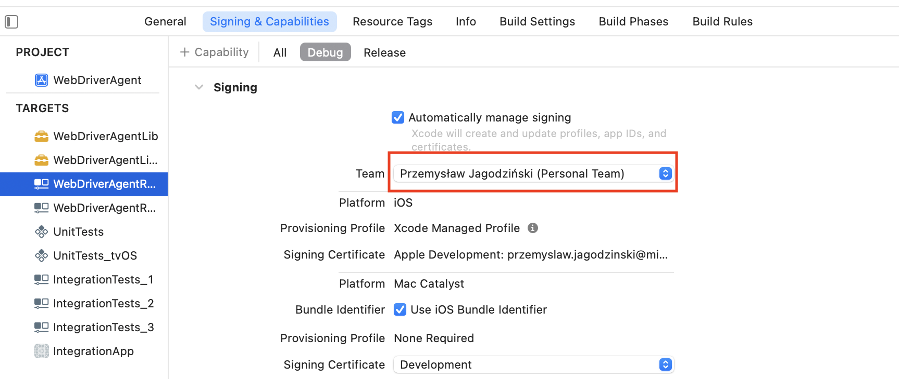

# Devices setup for Appium mobile testing

### Intro
You don't have to do this. There are plenty of cloud solutions, farm of devices like Browserstack or SauceLabs which solve 
many problems with setup, and I recommend you to use it on a daily basis. But if you are crazy enough (And we both know that you are, because you are here)
to set up locally, go ahead :) With my little manual the process will be much easier!

### Android Device Setup
Unlike the iOS, the Android device setup is pretty easy. The only thing is to enable 'Developer Options'.
Navigate to Settings -> About Phone and find Build number. Then tap several times on it
and 'Developer Options' should be enabled.
Before running tests be sure that 'File Transfer' option is enabled. This will allow uploading .apk
to your test device.

### iOS Device Setup
Now the difficult part. Obviously you will need to have macOS with Xcode.
In order to start app and run tests, WebDriverAgent needs to be installed firstly and
provisioning should be granted to the appropriate user.

Before you do that, remember that WebDriverAgent and Xcode versions must be compatible. Unlike Android, ios will not allow you
to install WebDriverAgent on your device. Even if it is built correctly with correct provisioning.

 - Navigate to the place where appium is installed. It should be located in node_module: /opt/homebrew/lib/node_module.
Then run

    > npm -g i appium-webdriveragent

 - The appium-webdriveragent catalogue should be crated. Go inside and open WebDriverAgent.xcodeproj file in Xcode.
In the Project tree open WebDriverAgentRunner and navigate to [Signing & Capabilities] tab.
Select your Team from the drop-down field. In my case it is my AppleId. If you do not have it please create it (Image 1).

Image 1. Xcode project configuration
 

You might still see some issues like

    The app identifier "com.facebook.IntegrationApp" cannot be registered to your development team because it is not available. Change your bundle identifier to a unique string and try again.
In this case go to [Build Settings] tab and change 'Product Bundle Identifier' to some non-existing (Images 2 and 3).
Don't ask me why is that :)

Image 2. Xcode project configuration
 

Image 3. Xcode project configuration
 

 - Having this, connect your device to you MacBook and select it in the Xcode.
Then run the build. In the first run, build passes but the WebDriverRunner do not start. This is because you
have to allow iOS developer (the one you entered in the 'Team' field) to install any app. So go to
device Settings -> General -> Device Management -> AppleDevelopment: {your appleID} and tap Trust.
Run in Xcode again and if everything works fine the WebDriverRunner should start. If not
go to the command line where appium-webdriveragent is installed and run command below with udid as the id of the device.

    > xcodebuild -project WebDriverAgent.xcodeproj -scheme WebDriverAgentRunner -destination 'id={udid}' test

